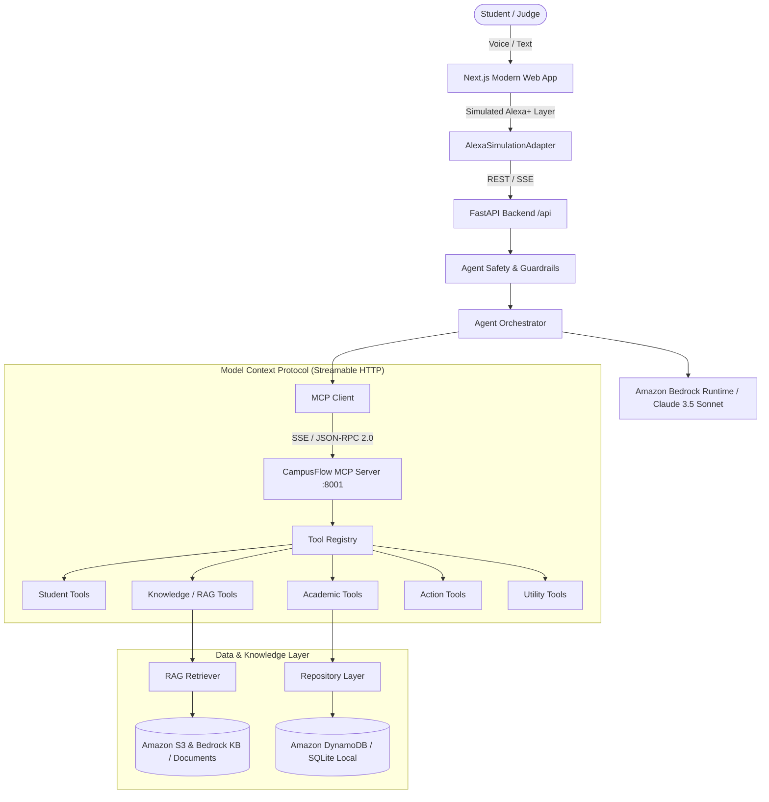

# CampusFlow AI Architecture Specification

## 1. System Architecture Overview

## 2. Component Details

### A. Frontend Layer
- **Framework**: Next.js 15+ App Router, React 19, TypeScript, Tailwind CSS, Lucide Icons.
- **Alexa+ Simulated Interface**: Real-time microphone audio capture using the Web Speech API with automatic state management (`IDLE -> LISTENING -> TRANSCRIBING -> THINKING -> CALLING TOOLS -> RESPONDING -> COMPLETE`).
- **Observability**: Live tool activity feed displaying tool name, latency in milliseconds, status, and parameters.

### B. Agent Orchestrator
- Implements the agent reasoning loop:
  `GOAL -> CONTEXT -> REASONING -> MCP TOOLS -> ACTION -> CONFIRMATION`
- Grounded citations: Links responses directly to institutional circulars and syllabi.
- Proactive intelligence: Monitors attendance drops below 75% and unsubmitted assignments.

### C. MCP Server (Streamable HTTP)
- Listens on `http://127.0.0.1:8001`.
- Provides Server-Sent Events `/sse` for event streaming.
- Handles standard JSON-RPC 2.0 requests over `/messages`.
- Implements 18 validated tools across Student, Academic, Knowledge, Action, and Utility domains.

### D. Security & Guardrail Layer
- Enforces user tenant isolation.
- Defends against system prompt injection and credential dump attacks.
- Sanitizes incoming documents to prevent prompt hijacking.
